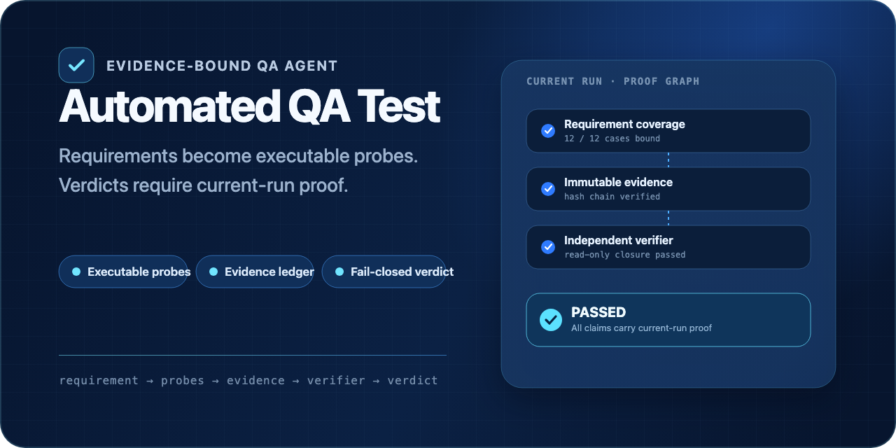

# Automated QA Test

[](https://github.com/Hoshino-wind/automated-qa-test/actions/workflows/ci.yml)
[](LICENSE)

[English](README.md)



把一条产品需求转化为可执行探针、本次运行的真实证据，以及一份在证据不足时拒绝“通过”的严格结论。

```text
需求 → 测试矩阵 → 浏览器 / API / Stream / Command 探针
     → 证据账本 → 独立证明验证 → Verdict + Report
```

## 15 秒了解项目

AI 生成的测试报告可能看起来很完整，但底层行为并没有真正被观察。Automated QA Test 把每一个 `Passed` 都视为证据完整性问题：

- 将需求编译成可追踪测试用例和可执行探针；
- 把证据绑定到本次运行、原始需求、测试、步骤和内容哈希；
- 允许受预算约束的 Agent Loop 继续调查，但模型输出永远不等于执行授权；
- 旧文件、需求覆盖缺口、危险命令、未处理运行错误和并发写入都会默认失败关闭；
- 由独立只读验证器闭合“状态 → Manifest → 不可变 Attempt → 当前输入”的证明图。

它是一套面向 Codex 的需求驱动、证据绑定 QA Skill，而不是让模型给自己生成的报告打分。

## 运行要求

- Python 3.12+
- Node.js 20+
- npm
- 浏览器探针需要 Chrome 或 Playwright 管理的 Chromium

请在隔离的 Python 环境中安装固定范围的运行依赖：

```bash
python3 -m venv .venv
source .venv/bin/activate
python3 -m pip install "cryptography>=47,<48"
npm ci
```

`pyproject.toml` 管理 Python 依赖合同，`package-lock.json` 管理本地与 CI
使用的 Node 依赖图。runner 不再从个人 Codex Skill 目录借用 Playwright。

## 安装 Skill

```bash
mkdir -p "${CODEX_HOME:-$HOME/.codex}/skills"
cp -R skills/automated-qa-test "${CODEX_HOME:-$HOME/.codex}/skills/"
```

使用时以 `$automated-qa-test` 提供需求、Issue、PR 或 Bug 描述。

## 唯一推荐流程

先显式声明环境与数据边界并初始化：

```bash
python3 skills/automated-qa-test/scripts/init_qa_artifact.py \
  --requirement-file /path/to/requirement.md \
  --base-url http://127.0.0.1:3000 \
  --runtime-mode test \
  --data-boundary-status "隔离测试库；不含生产数据"
```

人工复核生成的 matrix 与 plan 后，运行完整闭环：

```bash
python3 skills/automated-qa-test/scripts/run_qa_cycle.py \
  --run-dir /path/to/run \
  --preflight-runtime \
  --strict-runtime
```

`run_qa_cycle.py` 是正常执行入口。它会刷新语义产物、检查需求覆盖、验证并以 SHA-256 绑定计划、执行探针、生成并审计证据账本、派生缺陷与下一探针、写入严格 verdict，最后生成报告。

含 `command` 的计划必须把 `playwright_probe.mjs` 绑定到通过的 `plan-audit-summary.json`，且摘要中的计划路径和哈希必须与当前文件完全一致。shell 字符串和 `shell: true` 默认拒绝，应使用关闭 shell 执行的数组命令；`--allow-unsafe-command` 只能放宽普通 shell 边界，不能放行秘密文件读取、导出、上传、写入或其他秘密变更。所有输出默认必须位于 `--run-dir` 内；若输出目标是目录，系统会保留目录并阻断，不会递归删除。

## 携证运行内核

每个 cycle 与外层 Agent loop 现在都只有一份总墙钟/探针/输出预算和一个逻辑写入者。cycle 持有带 generation 围栏的文件租约，追加哈希链事件，把本轮 current 输出提交为不可变 attempt；只有独立只读 verifier 闭合“状态 → manifest → attempt → 当前输入”证明图后，才允许发布 `Passed`。旧文件、父输入替换、未提交 verdict、历史 attempt、损坏事件或并发写者都会默认失败关闭。

任何探针派发前，编排器都会编译当前仓库/context snapshot，并根据已验证计划与
规范 `ToolSpec` registry 生成 `action-contracts.json`。runner 在副作用前持久化
`intent`，完成后再向 `action-journal.jsonl` 写入 `commit`。只有 ToolSpec 明确声明
幂等的未决动作才能用同一 key 恢复；不确定的非幂等动作必须转人工 reconciliation。

默认上限为：整轮 1,800 秒、单阶段 300 秒、500 个探针、16 MiB 子进程输出，以及 2 秒 TERM→KILL 宽限。可显式覆盖：

```bash
python3 skills/automated-qa-test/scripts/run_qa_cycle.py \
  --run-dir /path/to/run \
  --total-timeout-seconds 1800 \
  --stage-timeout-seconds 300 \
  --max-probes 500 \
  --max-output-bytes 16777216 \
  --termination-grace-seconds 2
```

`qa_agent_loop.py` 会跨全部 iteration 累计这些额度，新一轮不会刷新探针或输出预算。可独立复核一个终局结果：

```bash
python3 skills/automated-qa-test/scripts/verify_run_proof.py \
  --run-dir /path/to/run
```

验证器把 `proof_valid` 与 `can_claim_pass` 分开报告。证明闭合的失败和
取消/超时仍然是 non-PASS observation；只有已验证的 success 才能授权
`can_claim_pass=true`。

`qa-run-summary.json` 与报告仍只是 projection。权威链由 `run-events.jsonl`、`run-manifest.json`、其引用的不可变 attempt，以及当前且哈希绑定的 verdict 构成。

一旦 cycle 启动受管服务，普通阶段会为真实 stop/cleanup 保留最后 10 秒与 64 KiB
预算。state transition 与 stage/action/cleanup span 还会写入独立哈希链
`agent-trace.jsonl`，proof verifier 必须闭合它们的顺序、命令哈希、attempt 和当前
context 绑定。`--skip-probe` 仅用于规划/阻塞 handoff，不派发动作，也绝不允许 `PASS`。

## 默认失败关闭门

默认只有同时满足以下条件，`can_claim_pass` 才可能为 `true`：

- plan、matrix、results、ledger 的主版本均为 2；
- requirement source 已完整映射；
- plan audit 通过且绑定当前计划哈希；
- `results.json` 经证据审计绑定到当前 ledger；
- 没有未解释的运行时、服务、Adapter、缺陷或流水线问题；
- `adapter-context.json` 已确认运行环境与数据边界。

`--allow-unconfirmed-environment`、`--allow-unvalidated-plan`、`--allow-missing-requirement-coverage` 只用于显式的规划或不完整运行，不能把这类输出描述成真实环境通过。

如果自定义探针没有 `results.json`，审计与终局都必须绑定 provenance manifest：

```json
{
  "schema_version": 1,
  "mode": "manual",
  "operator": "qa-user",
  "observed_at": "2026-07-22T12:00:00+08:00",
  "statement": "证据来自已声明的隔离测试环境。",
  "evidence_ids": ["E1", "E2"]
}
```

```bash
python3 skills/automated-qa-test/scripts/audit_evidence.py \
  --matrix /path/to/run/test-matrix.json \
  --ledger /path/to/run/evidence-ledger.json \
  --manual-evidence-manifest /path/to/run/manual-evidence-manifest.json \
  --summary /path/to/run/audit-summary.json
```

手工模式是显式、可审计且带哈希绑定的；只手写 `current_run`、`assertions` 或 `proves` 不再能得到最终通过。

## 项目 Adapter

通用内核不保存具体项目路径。可选项目知识放在 `skills/automated-qa-test/references/adapters/*.json`：marker、服务、端口、env/config 候选、证据层、预检路由和探针默认值都由 Adapter 配置拥有。通用脚本只读取 registry 协议。

新增定义必须先通过 `adapter_registry.py --definition ... --project-root ...`
生成严格 onboarding 报告；该报告固定为 `not_evidence/not_authorization`，不能冒充
产品 QA 结果。

## Agent 控制面与发布门

- `agent_critic_cli.py` 与 `agent_schedule_cli.py` 只给出建议，始终不是执行授权。
- `human_control_cli.py` 管理 Ed25519 签名的 HITL 与已确认 Knowledge；生产模式还要求
  独立签名且未过期、精确覆盖当前 journal 的 checkpoint；未覆盖 tail 失败关闭，
  production consume 必须在 checkpoint 刷新后才能通过 resume 确认。高风险 runtime
  dispatch 还要求第二次刷新 checkpoint 与 durable one-shot redemption；恢复只能在
  人工核对后显式增加 execution epoch。Knowledge 始终是 `not_evidence=true`，其当前
  精确查询快照会被哈希绑定进 ContextSnapshot。
- `agent_slo_report.py --run-dir ...` 只从现场重算且通过的 run proof 聚合生产 SLO。
- `agent_eval.py --production` 校验独立 evaluator 对语料、候选、baseline、阈值和预算的
  注册；`agent_release_admission.py` 现场重算评测与 SLO 后才可能签发 P2 发布准入。

这些控制面都不能替代单个 runtime action 的 policy/ToolSpec authorization。本仓库不
内置可自签的生产资格；真实 qualification 仍要求外部控制的 authority、held-out corpus
与 proof-backed 运行。

## 架构边界

`scripts/*.py` 保持稳定的命令行兼容入口；`scripts/qa_core/contracts` 集中拥有产物路径、JSON Schema 运行时校验、证据字段和 runner 绑定规则，`scripts/qa_core/pipeline` 集中拥有 `CycleOptions`、`CycleContext` 与统一的阶段执行/记账边界。`scripts/qa_core/runtime`、`state`、`observability`、`proof` 拥有有界进程、durable action intent、租约、不可变 attempt、事件/trace 归约和证明验证；`context`、`hitl` 与 `knowledge` 拥有当前上下文和外部锚定的人机控制状态；`qa_eval` 拥有独立评测与发布准入。Planner/Diagnostician/Critic 均使用严格 proposal 合同；精确 model id 与 evidence ref allowlist 由调用方在模型输出之外注入，Diagnostician 只能引用当前 plan 的假设/探针和 allowlist 内的 trace observation。模型输出固定是 `not_authorization=true` 的建议，Scheduler 输出也不能自我授权。`CycleRuntime` 依次组合需求覆盖、预检、Adapter、计划、探针、证据、清理和结论阶段。

脚手架内部遵循 `qa_scaffold/support → intents → modeling → rules → entry` 单向依赖，原 `scaffold_requirement.py` 继续提供既有 Python 导入和 CLI；需求分类被拆为信号采集、冲突消歧和 3 个标签投影族，需求专属证据映射以及基础、韧性、认证、完整性、高级、UI 交互和运行时规则均由原公开入口调度有界的私有领域助手。回归侧将代码 PR、需求源覆盖和 Agent 路由协议分别放入仅依赖 support 的专属模块，再由 `contracts` 或 `agent` 兼容导出稳定夹具入口；构建发布与秘密安全夹具继续拆为私有子场景注册表，同时保持 7 族公开夹具契约不变。`regression_check.py` 只负责夹具注册、完整阶段编排和 CLI；架构测试持续约束依赖方向、有界私有场景注册表与兼容导出。

CI 会在编译和测试前执行 Ruff `E`、`F`、`I` 门禁。需求与夹具中的长篇原文明确不受 `E501` 数值限制，测试启动器允许在显式设置本地 `sys.path` 后导入；未使用导入、死局部变量和导入顺序仍会阻断 CI。

生产候选的架构、不变量、SLO 与 held-out 协议见 [`CONTEXT.md`](CONTEXT.md) 和 [`docs/architecture/agent-v2.md`](docs/architecture/agent-v2.md)。`agent_eval.py` 是严格的 evaluator-owned 评分器，不代表项目已经跑过生产语料；正式资格仍要求独立方冻结并签名的 200 个场景 × 3 个 seed 语料、deterministic baseline 与 proof-backed SLO roots。

## 运行产物与状态

完整运行会产出需求、业务/Oracle 模型、charter、matrix、plan、环境上下文、预检/服务记录、需求与计划审计、results、ledger、audit、defects、next probes、verdict、Agent handoff 和报告。业务模型、Oracle、指标都标记为 `not_evidence=true`，不能替代当前运行证据。

合法状态只有 `Passed`、`Failed`、`Blocked`、`Untested`、`Inconclusive`。

## 维护验证

快速安全与语法检查：

```bash
npm test
python3 -m compileall -q skills/automated-qa-test/scripts
```

`npm test` 还会运行 `references/modeling-adversarial-cases.json` 中独立于内置 gold corpus 的上下文对抗语料，覆盖静态安全术语、422 表单校验体验、撤销业务不变量和浏览器滚动状态恢复。

完整维护回归：

```bash
npm run test:regression
python3 skills/automated-qa-test/scripts/regression_check.py --with-browser
```

本地还可解析夜间 capability matrix，并运行离线失败关闭故障注入：

```bash
python3 skills/automated-qa-test/scripts/nightly_agent_matrix.py \
  --repo-root . \
  --out /tmp/nightly-agent-matrix.json
python3 skills/automated-qa-test/scripts/nightly_fault_injection.py \
  --out /tmp/nightly-fault-injection.json
```

开发中可以列出并定向执行隔离回归组；不传 `--group` 时仍执行原有完整非浏览器回归：

```bash
python3 skills/automated-qa-test/scripts/regression_check.py --list-groups
python3 skills/automated-qa-test/scripts/regression_check.py --group contracts --group evidence
```

CI 会执行依赖安装、Python 编译、安全套件、Node 语法检查和完整的非浏览器回归。
