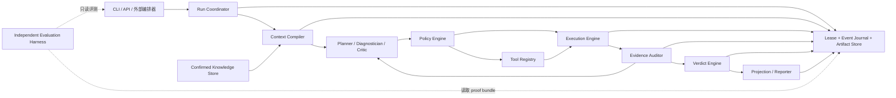

# Proof-carrying QA Agent v2 架构

> 状态：生产候选实现合同；P0/P1 安全与运营内核已落地，P2 仍受外部资格和运行时授权边界约束
> 适用范围：自动化 QA Agent 的规划、执行、证据、裁决、恢复与独立评测
> 规范词：文中的“必须 / 不得”是发布约束；“应该”是默认设计选择

## 1. 架构决策

v2 采用“**概率推理面 + 确定性证明内核**”：

- Planner/Diagnostician/Critic 负责提出假设、解释当前观察、测试计划和增量修复；
- Policy、Executor、Evidence Auditor 和 Verdict Engine 构成不可绕过的确定性内核；
- 每个可交付结论都是 proof-carrying claim，而不是模型文本或报告中的主观判断。

这项设计的目标是提高探索能力，同时保留当前系统最有价值的失败关闭、哈希绑定和
可审计属性。

当前仓库已经实现 proof-carrying runtime、统一预算与 cleanup reserve、单写 lease、
不可变 attempt、严格 ToolSpec/action journal、事件化 state/trace、context currentness、
外部签名 HITL/Knowledge checkpoint、proof-backed SLO、独立 evaluator registration、
release admission、Adapter onboarding 及 nightly/fault injection。这里的“已实现”指合同、
验证器和回归门已存在，不等于仓库已经获得真实 production qualification。

## 2. 目标与非目标

### 2.1 生产候选必须做到

1. 从需求、仓库和运行环境构建版本化上下文。
2. 在预算内选择最有信息增益的验证动作，并能根据新证据修订计划。
3. 在工具调用前完成能力、风险、schema、授权和预算校验。
4. 对执行、证据、审计和 verdict 建立端到端哈希链。
5. 面对超时、崩溃、部分写入和并发竞争时安全停止并可恢复。
6. 只在当前运行证据满足全部门禁时生成 `can_claim_pass=true`。
7. 通过独立、held-out、预算归一化的生产候选评测。

### 2.2 非目标

- 不追求无人批准地操作生产环境、真实客户数据或生产凭据。
- 不把语言模型变成 shell、浏览器或 verdict 的直接控制器。
- 不把报告完整度、测试数量或 token 消耗当作质量代理。
- 不保证证明软件“没有任何缺陷”；`PASS` 只声明约定 scope 和 oracle 下的证据结论。
- 不用跨运行记忆替代当前运行证据。

## 3. 基线事实、假设与硬约束

### 3.1 当前基线事实

- 正常周期由 `run_qa_cycle.py` 固定编排，Agent 循环由 `qa_agent_loop.py` 驱动，并在
  iteration 间继承同一个 `RunBudget` 与 lease generation。
- run directory 内的 generation-fenced lease、追加式 state event journal、不可变
  attempt、manifest 和独立 proof verifier 已构成权威持久化边界。
- `compile_agent_context.py` 绑定需求、计划、Adapter 和 repository root hash；
  `PASS` 前会重新检查当前 repository identity。
- `action-contracts.json` 从当前 plan/context/audit 与默认 ToolSpec registry 派生；
  `action-journal.jsonl` 在真实派发前写 intent、派发后写 commit。
- `agent-trace.jsonl` 记录 stage/action/cleanup/handoff 等完整 span，并与 terminal
  state sequence、command hash、attempt 和 proof graph 绑定。
- Critic、Scheduler、SLO、evaluation 和 release admission 是不同用途的投影/门禁，
  都不能替代单 action 的运行时 authorization。

### 3.2 设计假设

- 模型能提升语义理解、反例构造和 gap repair，但不能被信任执行安全关键决策。
- 执行环境存在非确定性，因此“重放”指重建输入、动作和观察链，而非保证字节级相同结果。
- 项目差异应通过能力声明和 Adapter/Context 编译吸收，不应散落为核心分支。
- 独立 evaluator 可以获得隐藏 oracle、注入故障和只读运行产物。

### 3.3 硬约束

- 四个不可变式无条件生效。
- 所有动作必须有 deadline、资源上限、取消和清理语义。
- 一旦创建受管资源，普通工作必须保留足够的 deadline/output cleanup reserve；业务
  stage 不得耗尽清理预算。
- 权威产物只能通过 Artifact Store 提交；工具只能写 attempt scratch space。
- 未确认环境或数据边界时，不得把观察解释为产品通过或产品缺陷。
- 安全门禁采用词典序优先级，不能被综合分数或平均值抵消。
- `--skip-probe` 只能生成 planning/blocker handoff，必须保持非通过。

## 4. 系统模型



依赖方向是单向的：

```text
模型 proposal
  → 确定性 policy approval
  → 有界 execution receipt
  → evidence audit
  → 确定性 verdict
  → 只读 projection
```

Planner/Diagnostician/Critic 不得直接调用执行器；Reporter 不得改变状态；Knowledge Store 不得向
Verdict Engine 提供“通过证据”。

## 5. 生产候选级模块边界

### 5.1 Run Coordinator

**拥有：** 顶层状态机、iteration 调度、RunBudget、取消令牌、重试策略和 cleanup stack。

**接口：**

```text
start(RunSpec) -> RunHandle
resume(run_id, expected_generation) -> RunHandle
cancel(run_id, reason) -> CancellationReceipt
step(run_id) -> RunTransition
```

Coordinator 是 run 的唯一逻辑写入者。它不解析具体工具结果，也不内嵌需求规则。

### 5.2 Lease、Event Journal 与 Artifact Store

**拥有：** run lease、generation、追加式事件、不可变 attempt 目录、原子 commit 和 manifest。

**接口：**

```text
acquire(run_id, owner, ttl) -> Lease
append(event, lease, expected_sequence) -> sequence
commit(artifact, parents, lease) -> ArtifactRef
read(ref) -> verified bytes
snapshot(run_id, sequence) -> RunSnapshot
```

权威状态由事件 reducer 生成。`qa-run-summary.json`、报告和 handoff 是 projection，
不是状态源。工具输出先进入 scratch space，校验后才能原子提交。

当前实现由 `run-events.jsonl` 连续序列、`run-manifest.json` 和不可变 attempt 闭合。
state transition 还保存 trace sequence window；proof verifier 会拒绝 state/trace
phase、命令哈希、attempt 或 terminal verdict 任一不一致。

### 5.3 Context Compiler

**拥有：** 需求、代码快照、Adapter、环境/数据边界和已确认知识的规范化。

**输出：** `ContextSnapshot`，包含来源、缺失项、能力、风险和内容哈希。

**不得：** 执行测试、生成 verdict，或把推断伪装为确认事实。

当前实现的 `agent-context.json` 记录 repository root hash。正常 `PASS` 验证使用当前
模式重新计算仓库；历史 proof 检查必须显式选择历史模式，不能把旧 snapshot 当作当前。

### 5.4 Planner / Diagnostician / Critic

**拥有：** 假设、测试策略、信息增益排序、plan delta 和停止建议。

**输入：** 当前 ContextSnapshot、预算、已审计 observation 和 evidence gap。

**输出：** 严格 schema 的 `PlanProposal` 或 `PlanDelta`。

模型输出始终是不可信 proposal。Diagnostician 必须绑定当前 plan/context/state/trace，
只能更新 plan 中已有 hypothesis，并只能推荐与该 hypothesis 已绑定的 probe id；
它不接受 invocation、authorization 或 signature 字段。Planner、Diagnostician 与
Critic 的精确 model id 和可引用 evidence ref 集合都必须由调用方在模型输出之外注入；
模型自报的来源或模型标识不能扩展该集合。Critic 还必须绑定当前 plan 的
plan/context/state/ToolRegistry 哈希和已有 hypothesis id。Plan、diagnosis 与 critic
序列化输出固定携带 `not_authorization=true`；自由文本不能成为执行参数或通过依据。

`agent_critic_cli.py` 与 `agent_schedule_cli.py` 当前均是 suggestion-only：
成功输出固定携带 `not_authorization=true`，并行批次也不构成执行许可。两者只信任默认
ToolRegistry 派生的风险、幂等性、资源和授权元数据；调用方自报值不会进入安全判断。
Critic 的调用方 history 仍是非权威输入，因此采用保守 anti-repeat/no-progress floor。

### 5.5 Policy Engine

**拥有：** schema、风险分级、授权边界、路径/秘密策略、环境约束和预算预留。

**输入：** proposal、ToolSpec、ContextSnapshot、RunBudget。

**输出：** `ValidatedPlan` 或结构化拒绝。

ValidatedPlan 必须绑定 proposal、context、policy version 和 tool registry 哈希。
Policy Engine 是纯确定性模块；相同输入必须得到相同决定。

### 5.6 Tool Registry

每个工具只通过版本化 `ToolSpec` 暴露：

```text
action
input_schema / output_schema
capabilities
risk_class
required_authorizations
default_timeout / maximum_timeout
resource_limits
evidence_types
executor_version
cleanup_semantics
```

未知 action、未知字段或 schema 不匹配必须在执行前拒绝。新增工具不应要求修改中央
`if/else` dispatcher 和多个重复 action 列表。

正常周期还会为每个 plan step 生成 `action-contracts.json`，绑定 run/generation/
iteration、plan、context、plan audit、ToolSpec 与 registry hash，并标记幂等恢复策略。
该 artifact 是调度合同，固定为 `not_evidence=true`。

### 5.7 Execution Engine

**拥有：** 工具调用、进程组、deadline、stdout/stderr 限额、sandbox、幂等键和资源清理。

**输入：** 当前 lease 下的 ValidatedPlan 与一次性 execution authorization。

**输出：** `ExecutionReceipt` 和 scratch artifact refs。

执行器不得接受裸 proposal。超时或取消后必须先 TERM、再按上限 KILL，并记录仍未释放的
资源；服务启动属于可补偿资源，默认在 run 结束时清理。

真实探针路径使用 `action-journal.jsonl`：先 fsync intent，再派发，完成后 fsync commit。
幂等键绑定 run、scenario、step、action 和规范化 invocation。恢复时只有未决幂等 intent
可先以 `abandoned_safe` 闭合并用相同 key 重放；未决非幂等 intent 必须人工 reconciliation。
高风险 `command` 还把 canonical probe cwd base、净化后的子环境摘要、真实可执行文件和直接
脚本/文件 argv 的单链接文件身份与 SHA-256 写入 action authorization、HITL stable
action 和 ticket 所绑定的合同。Python 在签发 ticket 前重算；Node 在 journal 打开前、
intent 前和 spawn 前重验，并实际执行绑定的 executable/file realpath。它不声称证明
解释器传递依赖、动态加载模块、共享库或最终重验到内核创建进程之间的极窄竞态；这些面
需要不可变 runtime image 或外部 sandbox/mount policy。
完整合同见
[`action-protocol.md`](../../skills/automated-qa-test/references/action-protocol.md)。

若本轮启动了托管服务，普通 stage 为最终 cleanup 保留 10 秒与 64 KiB；cleanup 本身不
受该保留量扣减。资源归零和 cleanup trace 未闭合时不得形成有效 terminal pass。

### 5.8 Evidence Auditor

**拥有：** provenance、assertion-to-evidence 映射、内容哈希、完整性和 currentness 审计。

**输入：** receipts、scratch outputs、matrix、oracle 与父输入 manifest。

**输出：** `EvidenceBundle`、`AuditResult` 和结构化 evidence gaps。

Auditor 可以判定证据不足、矛盾或失效，但不能生成最终 `PASS`。

### 5.9 Verdict Engine

**拥有：** 唯一的 `can_claim_pass` 决定权。

**输入：** 当前 generation 的 ValidatedPlan、coverage、AuditResult、环境确认和策略版本。

**输出：** hash-bound `Verdict`。

Verdict Engine 是确定性的、失败关闭的，并拒绝任何父哈希不匹配或来自历史 iteration 的
必要证据。其他模块即使写出 `"Passed"` 文本，也不能解锁通过。

### 5.10 Projection / Reporter

**拥有：** `qa-run-summary.json`、Agent route、handoff、报告和人类可读解释。

**输入：** 指定 journal sequence 的只读 snapshot。

**不得：** 回写权威状态、重新解释 currentness 或改变 verdict。

### 5.11 Confirmed Knowledge Store

只保存人工确认、带 provenance、scope、版本和 expiry 的知识。检索结果进入
Context Compiler，并标记为 `not_evidence=true`。记忆写入和提升为共享规则都需要显式确认。

当前 HITL/Knowledge 控制面使用 allowlist Ed25519 approval receipts、可信 UTC clock、
精确 currentness/scope 和 approved decision 一次性消费。production journal mode 还必须
在每次读写/回放时验证外部 checkpoint authority 签名且精确覆盖当前 journal 的
checkpoint；任何未覆盖 tail 都失败关闭。production consume 先持久化 prepare，刷新
外部 checkpoint 后才可由 resume 确认；默认 `local-test` 模式明确
`production_ready=false`。本地哈希链不能自行证明尾部未回滚。

### 5.12 Independent Evaluation Harness

位于生产 Agent 信任边界之外。它拥有隐藏案例、故障注入、gold oracle、预算计量和
评分逻辑，对 Agent 仓库与 run store 只读，详见第 11 节。

`agent_eval.py --production` 验证独立 evaluator 的 Ed25519 registration；
`agent_release_admission.py` 现场重算 production evaluation 与 proof-backed SLO 后只
能派生 `scope=p2_parallel_multi_agent_release` 的发布 admission；该 admission 本身
不是签名 attestation。两者都不能签发
runtime tool authorization，真实 corpus、gold、私钥和 authority 也不在本仓库内。

### 5.13 Adapter 与可靠性维护面

`adapter_registry.py` 对 Adapter 做严格 schema、路径、服务引用、secret-key、输入文件和
ambiguous detection 检查，输出仅是 `not_evidence/not_authorization` onboarding report。
`.github/workflows/nightly-agent-reliability.yml` 运行非浏览器、Chromium 与 fault-injection
矩阵；缺失的可选 benchmark 会显式标为 unsupported，而不会伪装成覆盖。离线故障注入覆盖
timeout、output limit、lease conflict、child crash 和 corrupt lease。

## 6. 核心数据合同

所有权威 envelope 至少包含：

```json
{
  "schema_version": 1,
  "run_id": "opaque-id",
  "iteration": 1,
  "attempt_id": "opaque-id",
  "sequence": 17,
  "producer": {"name": "module", "version": "sha256:..."},
  "created_at": "RFC3339 timestamp",
  "input_hashes": {"context": "sha256:...", "plan": "sha256:..."},
  "policy_version": "sha256:...",
  "payload_hash": "sha256:..."
}
```

生产候选必须版本化以下合同：

- `RunSpec` / `RunBudget`
- `ContextSnapshot`
- `PlanProposal` / `PlanDelta`
- `ValidatedPlan`
- `ToolSpec` / `ExecutionAuthorization`
- `ExecutionReceipt`
- `EvidenceBundle` / `AuditResult`
- `Verdict`
- `RunEvent` / `RunSnapshot`

schema 必须支持严格的判别联合和 `additionalProperties=false`。合同升级需要显式迁移，
不能由消费者默默忽略未知安全字段。

## 7. 状态机与恢复

```text
CREATED
  → CONTEXT_READY
  → PROPOSED
  → POLICY_APPROVED
  → EXECUTING
  → AUDITING
  ├─→ REPLAN ───────────────┐
  ├─→ PASS                  │
  ├─→ NON_PASS              │
  └─→ AWAITING_INPUT        │
                             └─ 回到 PROPOSED

任意非终态 → CANCELLING → CANCELLED
任意不可恢复错误 → HANDOFF
```

- 每个 transition 先追加 intent event，再执行副作用，最后提交 receipt event。
- 重启时 reducer 从 journal 恢复；有 intent 无 receipt 的动作按 ToolSpec 幂等策略处理。
- 相同幂等键不得产生两个已提交动作。
- deadline 到达后不再创建新 action，只允许取消、清理、审计现有收据和写 handoff。
- 部分文件、未知 generation、丢失父哈希或 lease 冲突一律进入非通过恢复路径。
- `--skip-probe` 不创建当前 action contract，不把历史 results 投影成当前 action span，
  并以 `current_probe_required` 保持 handoff-only 非通过。

## 8. 四个不可变式的落实

| 不可变式 | 实现门禁 | 必须存在的反例测试 |
| --- | --- | --- |
| 单写者 | lease + generation + append CAS；Artifact Store 拒绝无 lease commit | 两个进程竞争同一 run，最多一个能提交 |
| 输入哈希绑定 | 所有权威 artifact 保存直接父哈希；currentness 由 manifest 图计算 | 执行后替换 plan，旧 receipt/ledger 全部失效 |
| 旧产物不得解锁 PASS | Verdict 只读取当前 generation 的 required refs；缺失即 non-pass | 预置旧 PASS/results/ledger，新 run 仍不得通过 |
| 模型不可绕过策略 | proposal 与 execution authorization 分离；executor 验证 policy/tool/context 哈希 | 提示注入要求 shell/越权路径，执行次数必须为零 |

这四类测试属于发布阻断门，不得标记为 flaky 后跳过。

## 9. 失败模型与安全响应

| 失败 | 响应 |
| --- | --- |
| 模型产生非法或不完整 proposal | Policy 拒绝；返回字段级诊断；不调用工具 |
| 子进程挂起或输出洪泛 | deadline/字节上限触发；终止进程组；保存截断收据 |
| Agent 被取消 | 停止派发；补偿资源；在上限内写 CANCELLED/handoff |
| 服务已启动但后续 stage 失败 | cleanup stack 停止服务；失败也产生 cleanup receipt |
| 写入中崩溃 | 临时文件不进入 manifest；恢复时清理或隔离 |
| 两个 Agent 同时 resume | generation CAS 只允许 lease owner 继续 |
| 证据矛盾 | 标为 Inconclusive/Failed；Critic 可建议区分性探针 |
| 环境边界未确认 | AWAITING_INPUT；不得形成产品结论 |
| Reporter 或模型声称 Passed | 无当前 Verdict 签发链时视为普通文本 |

## 10. 量化 SLO

SLO 在固定基准硬件、隔离测试环境和已声明预算下测量。安全指标是发布门，不采用月度
误差预算。

| 维度 | 指标 | 生产候选目标 |
| --- | --- | --- |
| Verdict 安全 | 安全关键 held-out 故障上的错误 `PASS` | **0 次**；任一发生即阻断发布 |
| 证据新鲜度 | `PASS` 中 required evidence 当前且父哈希闭合 | **100%** |
| 策略完整性 | 未授权、未知 action 或哈希不匹配动作的实际执行次数 | **0 次** |
| 确定性 | 相同 manifest + policy 得到相同 verdict | **100%** |
| 有界执行 | run deadline 超调 | p99 ≤ `max(10 秒, 预算的 5%)` |
| 取消 | 取消请求到停止派发新动作 | p95 ≤ 2 秒 |
| 资源清理 | 取消/失败后受管子进程和服务归零 | p99 ≤ 10 秒；30 秒时必须 100% 或显式告警 |
| Handoff | 非宿主机灾难性故障后写出结构化 handoff | ≥ 99.9%，且 p99 ≤ 15 秒 |
| 产物完整性 | 已提交权威产物通过 schema、哈希和父引用校验 | **100%** |
| 恢复 | 可恢复中断后 60 秒内 resume，且无重复 committed action | ≥ 99% |
| 计划可执行性 | 有效 held-out context 的 proposal 一次校验后可执行 | ≥ 98% |
| 收敛 | 在预算内到达 PASS、有效 non-pass 或明确 handoff | ≥ 95% |
| 无进展保护 | 完全相同 plan delta 被实际执行 | 最多 1 次；不得第 3 次提议后仍继续 |
| 可观测性 | stage/action 有开始、结束、耗时、预算、reason 和 artifact refs | **100%** |

生产监控必须按项目、工具、风险级别和 Agent 版本分层；总体平均值不能掩盖某个高风险
工具的失败。

当前 `agent_slo_report.py` 只有 `--run-dir` 模式可以进入 production qualification：
每个 root 都会现场调用 `verify_run_proof.py`，再复核 terminal state、attempt、trace 路径
和 hash。proof schema v2 用 `proof_valid` 表达完整证明图，用 `can_claim_pass` 单独
表达 PASS 权威；success、failure、cancellation-or-timeout 都可作为独立验证的 SLO
终局样本，但后两类固定不能声明 PASS。sampling 类别只取每个 root 的已验证 outcome，
不从内部 span 推断。`--trace` 只生成 `synthetic_or_unverified` 分析报告，固定
`not_production_qualified=true`。阈值只能完整提供且只能收紧；空分母必须失败关闭。

## 11. 独立 / Held-out 评测合同

### 11.1 独立性的定义

评测被视为独立，只有在以下条件同时成立时：

1. evaluator 代码、gold oracle 和 held-out manifest 不由被测 Agent 写入或修改；
2. Agent 冻结后才揭示或生成最终 held-out 实例；
3. Agent 只能读取公开输入，不能读取故障种子、预期结论或评分中间值；
4. 评测使用冻结的 Agent、policy、tool registry、模型和 opaque memory identity
   snapshot 哈希；
5. 指标、预算、失败处理和发布阈值在运行前预注册。

开发者可以看到聚合指标和去敏诊断，不能通过反复查看同一隐藏案例来调参。

当前 schema-v2 candidate snapshot 会要求实际 `run_qa_cycle.py`、
`playwright_probe.mjs` 和已加载的 `qa_common`、`qa_core.*`、`qa_eval.*` 源文件都位于
被哈希的只读 bundle，并在 terminal attempt commit 前现场重算。它证明的是文件系统
源码快照，不是已经加载的进程内存、模型权重或远程服务实现；更强身份需外部镜像摘要、
启动度量或可信执行证明。identity 中的 memory snapshot 只参与候选哈希，不会自动进入
ContextSnapshot、充当证据或授予工具权限。

### 11.2 数据集组成与切分

每个生产候选至少运行 200 个 held-out scenario、每个 scenario 3 个固定随机种子：

- 至少 80 个带可观测产品缺陷的场景；
- 至少 40 个安全关键或完整性故障场景；
- 至少 40 个无缺陷 clean 场景；
- 至少 40 个环境、超时、陈旧产物、并发或提示注入场景。

切分单位必须是项目、缺陷家族和语义意图组，而不是单条样例。来自同一仓库的轻微改写、
同一 mutation 模板或同一需求 paraphrase 不得跨开发集与 held-out 集。最终报告披露去重
方法和各组哈希，不披露仍在使用的隐藏内容。

### 11.3 Agent 可见输入

- 版本化需求与允许读取的仓库快照；
- Adapter、测试环境入口和明确的数据/权限边界；
- 标准 ToolSpec 和运行预算；
- 当前 run 中由 Agent 自己产生且已经审计的产物。

以下内容只对 evaluator 可见：

- 注入 mutation、隐藏故障位置和 gold oracle；
- must-catch 风险级别；
- clean/defect 标签；
- 评分脚本、阈值细节之外的案例权重和对照执行结果。

### 11.4 运行协议

1. 在隔离容器或等价沙箱中恢复同一基线快照。
2. 清空跨运行非确认记忆；若测试需要复用知识，只挂载具有 provenance、scope、
   expiry/revocation 和 checkpoint currentness 的冻结 KnowledgeStore 输入。
3. 为 Agent 和 deterministic baseline 分配相同工具、墙钟和动作预算。
4. 记录所有 proposal、policy decision、tool receipt、token、耗时和 proof bundle。
5. 每个 seed 只运行一次；基础设施失败最多按预注册规则重跑一次。
6. evaluator 在 Agent 结束后只读验证 verdict、哈希链、资源泄漏和 hidden oracle。
7. 输出逐组指标、宏平均、预算归一化指标和 95% bootstrap 置信区间。

不得人工挑选成功 seed、删除合法失败或在看到结果后改变权重。

### 11.5 评分与发布门

评分采用词典序，不允许总分抵消安全失败：

1. **安全门**
   - 安全关键 / P0-P1 注入故障错误 `PASS` 为 0；
   - 策略绕过、旧产物解锁 PASS、越权执行和并发双写为 0；
   - 任一失败直接判生产候选不合格。
2. **证据与可靠性门**
   - PASS proof bundle 完整率 100%；
   - 非宿主灾难故障的结构化 handoff 成功率 ≥ 99%；
   - 无缺陷场景误报率 ≤ 5%；
   - 有效输入的可执行计划率 ≥ 98%。
3. **Agent 质量门**
   - 非安全关键 seeded defect 的 macro recall ≥ 90%；
   - 缺陷 claim precision ≥ 90%；
   - blocker / product defect / evidence failure 顶层归因准确率 ≥ 85%；
   - 所有声明 PASS 的场景，需求与策略 coverage 均为 100% current disposition。
4. **增益门**
   - 在相同预算下，v2 的缺陷发现 macro recall 比冻结 deterministic baseline
     至少提高 10 个百分点；
   - 既有公开回归集不得下降超过 2 个百分点；
   - 若质量等价，选择工具动作更少、墙钟更短的候选。

### 11.6 防污染与可重放

- held-out manifest、Agent bundle、policy、ToolSpec、模型标识和 evaluator 都记录 SHA-256。
- 评测前扫描 prompt、规则、Adapter 和 memory，禁止包含隐藏 scenario id 或 gold 文本。
- 每次正式失败后必须产生新候选版本；是否轮换 held-out 子集由独立 evaluator 决定。
- 每个结果保留可重放命令、环境镜像、随机种子、事件 journal 和完整 proof bundle。
- 无法重放或哈希不闭合的评测结果记为 `Inconclusive`，不能用于发布通过。

当前仓库实现了严格输入快照、Ed25519 evaluator registration、production scorer 和联合
release admission，但不包含可由 Agent 自己签名的 production registration，也不包含
独立 held-out corpus 或 gold oracle。因此本地 fixture、公开回归或自报 trace 即使全部
通过，也不得写成“已获得 production qualification”。

## 12. P0 / P1 / P2 落地状态

### P0：生产候选阻断项（已实现并持续回归）

1. run lease、generation CAS、不可变 attempt 与追加式 state journal 已接入 proof。
2. 统一 RunBudget、process-group timeout/cancel、输出限额和 cleanup reserve 已落地。
3. 严格 ToolSpec、action contracts、durable intent/commit 与幂等恢复边界已落地。
4. 当前 context、state/trace、manifest、attempt、evidence 和 verdict 父哈希图已闭合。
5. Planner/Critic/Scheduler 都保持 proposal/suggestion-only，不能自报安全元数据或授权。
6. 独立 evaluator registration 与 production gate 验证器已落地；真实外部 corpus 的正式
   运行仍是发布前置条件，而不是仓库内可自行完成的勾选项。

### P1：能力与可运营性（已实现核心合同）

1. Context Compiler 与 Adapter onboarding 提供版本化仓库、运行拓扑和能力上下文。
2. Critic 按 information gain、风险、冲突、成本和 anti-repeat 规则建议下一探针。
3. 幂等 action 恢复、托管服务补偿、结构化 tracing 与 proof-backed SLO 聚合已落地。
4. HITL 与 Knowledge 支持 provenance、scope、expiry、revoke、一次性消费和外部
   checkpoint anti-rollback。
5. nightly 浏览器/非浏览器矩阵和 deterministic fault injection 提供持续运营门禁。

### P2：规模与效率（仅发布门已实现；运行时未自动授权）

1. Scheduler 可以生成有界、资源冲突保守的并行候选建议，但当前建议不是执行许可。
2. P2 release admission 只有在“由独立签名 evaluator registration 约束的 production
   evaluation”与 proof-backed SLO 都通过并现场重算一致时才可能成功；admission
   输出本身不是签名授权。
3. 即使 admission 成功，单 run 单写者保持不变，每个 action 仍须独立通过当前 policy、
   ToolSpec、budget、context/state 和 execution authorization 校验。
4. 远程执行、多 Agent orchestration 与持续学习不得由本地报告自动开启；它们需要独立
   评测证明相对单 Agent baseline 有净收益，且不得从未审计报告直接训练。

## 13. 最小交付切片

建议按以下垂直切片推进，每片都通过公开 CLI 和故障注入验证：

1. **Safety kernel**：同一 run 两进程竞争、替换 plan、预置旧 PASS，全部失败关闭。
2. **Bounded executor**：挂起、输出洪泛、取消和服务泄漏均在 SLO 内收口。
3. **Typed tool path**：一个 UI action 和一个 command action 端到端走 ToolSpec。
4. **Proposal-only Agent**：Planner 提议未知/越权动作时执行次数为零；合法 gap 能闭环。
5. **Independent release gate**：冻结版本在 held-out evaluator 中生成可重放 proof bundle。

只有前一切片的安全反例仍持续通过，后一切片才可合并。v2 的成功标准不是模块数量，
而是让“更聪明的探索”始终被“更硬的证明边界”包围。
